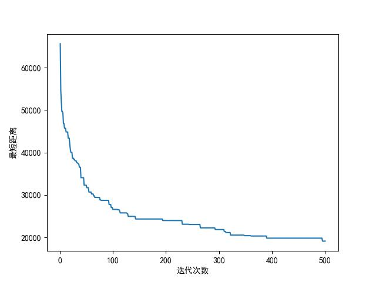

## GA for TSP

### 介绍
用遗传算法解决旅行商问题,参考[425776024/TSP-GA-py](https://github.com/425776024/TSP-GA-py)

### 软件架构
python3.9.0,ffmpeg

### 使用教程
运行main.py即可
````py
python main.py
````

参数分析等详细参见:[遗传算法解决TSP问题](https://www.cnblogs.com/Tenerome/articles/GATSP.html)

### 效果展示

#### 主程序
动态化

收敛距离

过程曲线图



